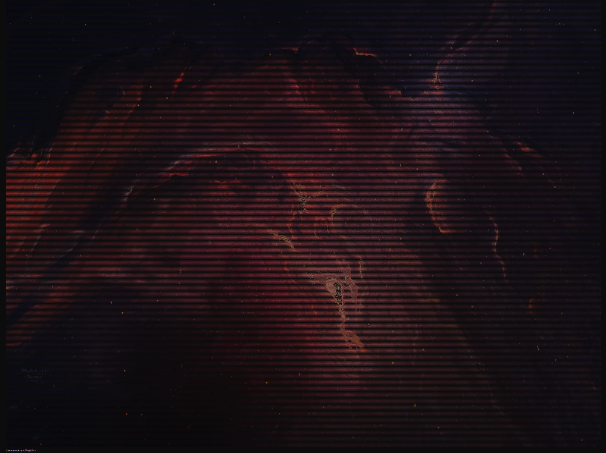

# Image to ASCII Art Converter

A Python command-line utility to convert images into ASCII art. This tool resizes the input image, maps its pixels to ASCII characters, and applies color to create artistic representations of the image directly in your terminal.

---

How It Works

Resize Image: The input image is resized to the specified width while maintaining the aspect ratio.

Convert to Grayscale: The resized image is converted to grayscale to simplify the mapping process.

Map Pixels to ASCII: Each pixel's intensity is mapped to a corresponding ASCII character based on brightness.

Add Colors: The original RGB values of the image are used to colorize the ASCII characters for a vibrant output.

Display in Terminal: The resulting colored ASCII art is printed directly to the terminal.


---

## Usage

To use, run the script with the following command:

```bash
python ascii_art_converter.py <image_path> [--width <width>]
```

### Parameters

- `<image_path>`: Path to the image file you want to convert.
- `--width <width>` (optional): Specify the width of the ASCII art (default is 100).

### Example

```bash
python ascii_art_converter.py doom.jpeg --width 500
```

### Original Image


### Output



